# Webinar Trident
Webinar Trident: El orquestador de almacenamiento para contenedores

## Modos de acceso

Un Persistent Volume se puede montar en un host de cualquier forma admitida por el proveedor de recursos. Los proveedores tienen diferentes capacidades y los modos de acceso de cada PV se configuran en los modos específicos admitidos por ese volumen en particular.

Los Persistent Volume Claims se emparejan a los Persistent Volume con modos de acceso similares. Los únicos dos criterios que han de coincidir son el modo de acceso y el tamaño.

| Modo de acceso | Abreviación | Descripción |
| :-------------: |:-----------:| :-----------|
| ReadWriteOnce | RWO | El volumen puede ser montado como lectura-escritura por un solo nodo |
| ReadOnlyMany  | ROW | El volumen puede ser montado como de solo lectura por muchos nodos   |
| ReadWriteMany | RWM | El volumen puede ser montado como lectura-escritura por muchos nodos |

### Creación de un PVC de tipo Read Write Only

Se crea un PVC de tipo Read Write Only


### Creación de un PVC de tipo Read Write Many

Se crea un PVC de tipo Read Write Many

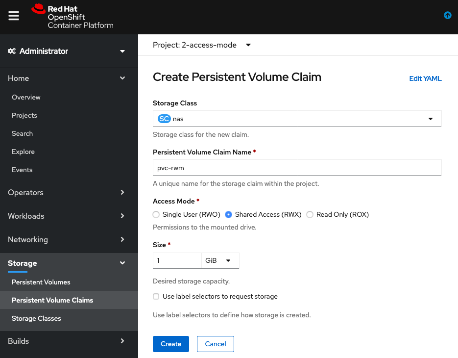

### Volumenes persistentes creados

Se verifican los Persisten Volumes creados.

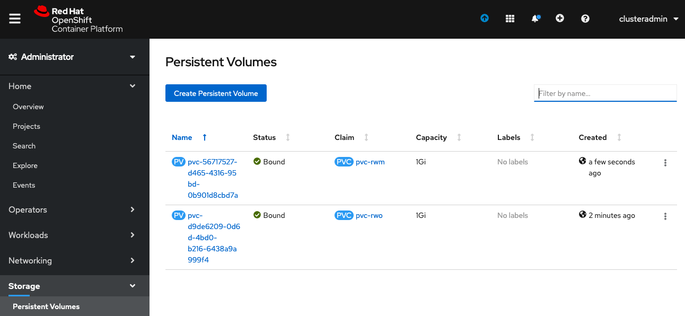

Se verifican los volúmenes que Trident ha creado automáticamente en ONTAP.

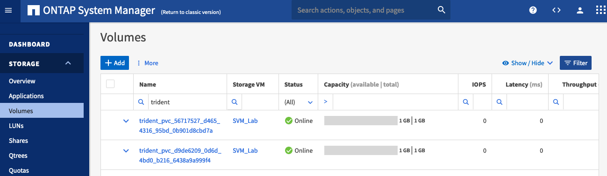

Se verifican la LUN que Trident ha creado automáticamente en ONTAP.

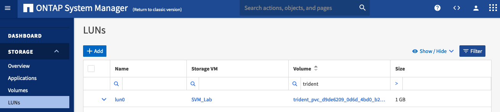

### Ejecución de aplicaciones (POD en un Deployment) con acceso RWM y con acceso RWO

Desde la parte de Developer de OpenShift Container Platform, se accede a Topology a se selecciona 'From Catalog'.

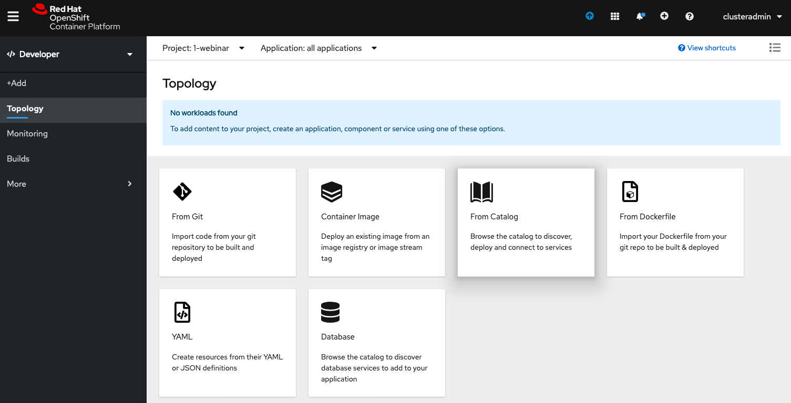

Se busca la plantilla ya creada por 'hello'.

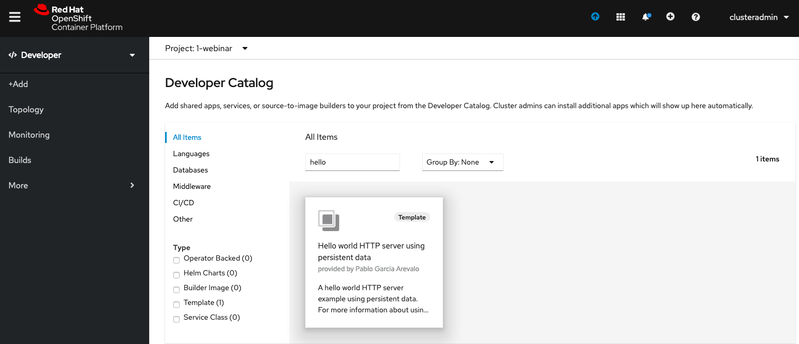

Se instancia la plantilla.

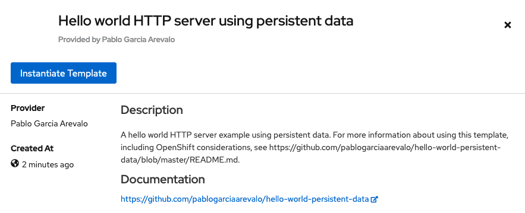

Se crea una aplicación basada en la planilla hello-world con acceso a un PVC existente de tipo RWM.

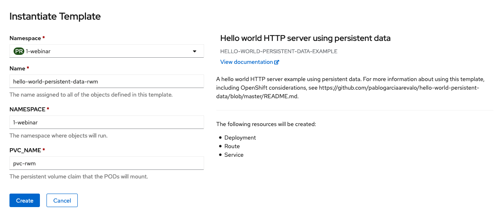

Se repiten los 3 pasos anteriores y se crea una aplicación basada en la planilla hello-world con acceso a un PVC existente de tipo RWO.

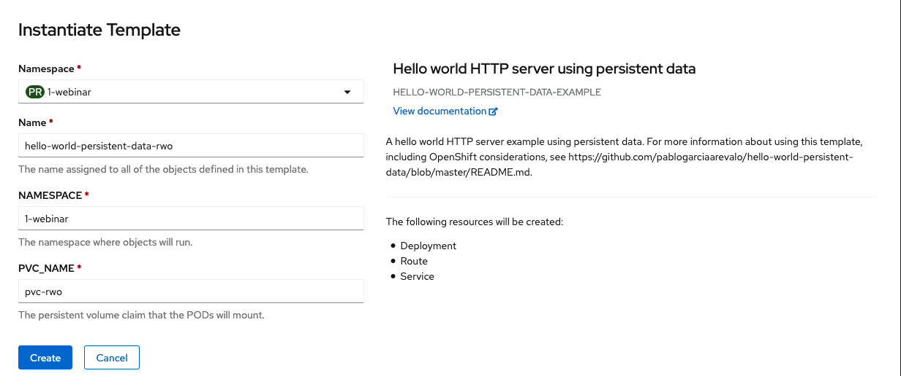

Se observa que se terminan de desplegar las aplicaciones y se accede a la web de cada una de ellas.

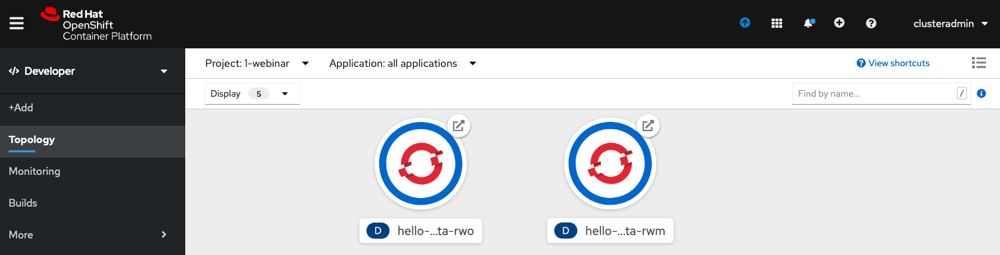

Se muestra que el punto de montaje del PVC RWM usado es un NFS.

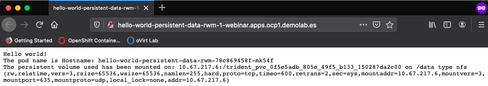

Se muestra que el punto de montaje del PVC RWO usado es una LUN.

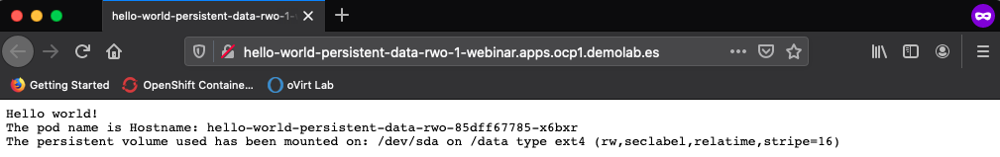

Escalar el deployment/replicaset de la aplicación usando el PVC RWM con dos pods 

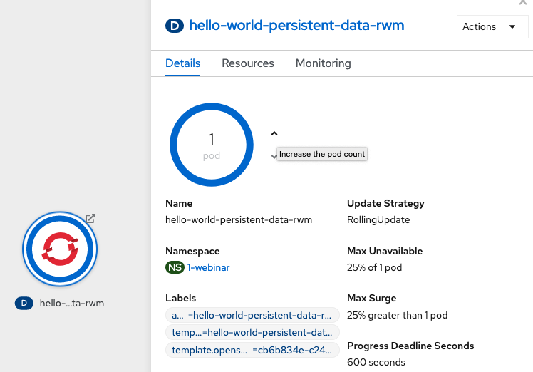

Ejecutar el siguiente comando para ver el balanceo de las peticiones HTTP contra los dos backends.
```shell
for i in {1..10}; do curl http://hello-world-persistent-data-rwm-1-webinar.apps.ocp1.demolab.es/; done

The pod name is Hostname: hello-world-persistent-data-rwm-78c869458f-mk54f
The persistent volume used has been mounted on: 10.67.217.6:/trident_pvc_0f5e5adb_805e_49f5_b133_150287da2c00 on /data type nfs (rw,relatime,vers=3,rsize=65536,wsize=65536,namlen=255,hard,proto=tcp,timeo=600,retrans=2,sec=sys,mountaddr=10.67.217.6,mountvers=3,mountport=635,mountproto=udp,local_lock=none,addr=10.67.217.6)

Hello world!
The pod name is Hostname: hello-world-persistent-data-rwm-78c869458f-pzbj9
The persistent volume used has been mounted on: 10.67.217.6:/trident_pvc_0f5e5adb_805e_49f5_b133_150287da2c00 on /data type nfs (rw,relatime,vers=3,rsize=65536,wsize=65536,namlen=255,hard,proto=tcp,timeo=600,retrans=2,sec=sys,mountaddr=10.67.217.6,mountvers=3,mountport=635,mountproto=udp,local_lock=none,addr=10.67.217.6)

Hello world!
The pod name is Hostname: hello-world-persistent-data-rwm-78c869458f-mk54f
The persistent volume used has been mounted on: 10.67.217.6:/trident_pvc_0f5e5adb_805e_49f5_b133_150287da2c00 on /data type nfs (rw,relatime,vers=3,rsize=65536,wsize=65536,namlen=255,hard,proto=tcp,timeo=600,retrans=2,sec=sys,mountaddr=10.67.217.6,mountvers=3,mountport=635,mountproto=udp,local_lock=none,addr=10.67.217.6)

Hello world!
The pod name is Hostname: hello-world-persistent-data-rwm-78c869458f-pzbj9
The persistent volume used has been mounted on: 10.67.217.6:/trident_pvc_0f5e5adb_805e_49f5_b133_150287da2c00 on /data type nfs (rw,relatime,vers=3,rsize=65536,wsize=65536,namlen=255,hard,proto=tcp,timeo=600,retrans=2,sec=sys,mountaddr=10.67.217.6,mountvers=3,mountport=635,mountproto=udp,local_lock=none,addr=10.67.217.6)

Hello world!
The pod name is Hostname: hello-world-persistent-data-rwm-78c869458f-mk54f
The persistent volume used has been mounted on: 10.67.217.6:/trident_pvc_0f5e5adb_805e_49f5_b133_150287da2c00 on /data type nfs (rw,relatime,vers=3,rsize=65536,wsize=65536,namlen=255,hard,proto=tcp,timeo=600,retrans=2,sec=sys,mountaddr=10.67.217.6,mountvers=3,mountport=635,mountproto=udp,local_lock=none,addr=10.67.217.6)

Hello world!
The pod name is Hostname: hello-world-persistent-data-rwm-78c869458f-pzbj9
The persistent volume used has been mounted on: 10.67.217.6:/trident_pvc_0f5e5adb_805e_49f5_b133_150287da2c00 on /data type nfs (rw,relatime,vers=3,rsize=65536,wsize=65536,namlen=255,hard,proto=tcp,timeo=600,retrans=2,sec=sys,mountaddr=10.67.217.6,mountvers=3,mountport=635,mountproto=udp,local_lock=none,addr=10.67.217.6)

...

```

El siguiente ejemplo muestra la forma de consumir almacenamiento según dos tipos de [controladores de Kubernetes](../3_k8s_controllers/k8s_controllers.md).

