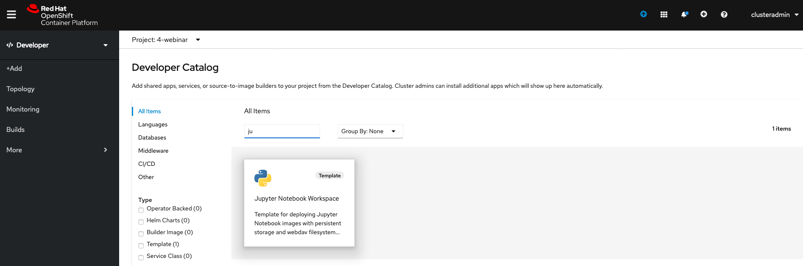
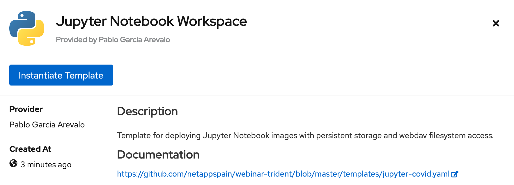
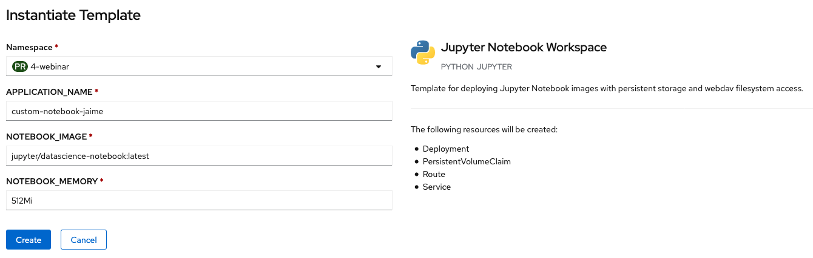
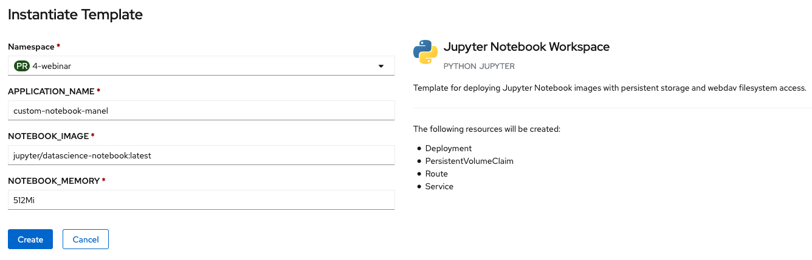
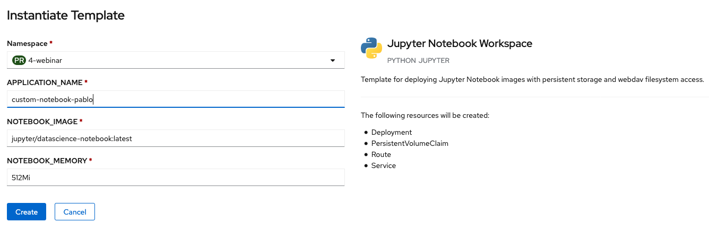
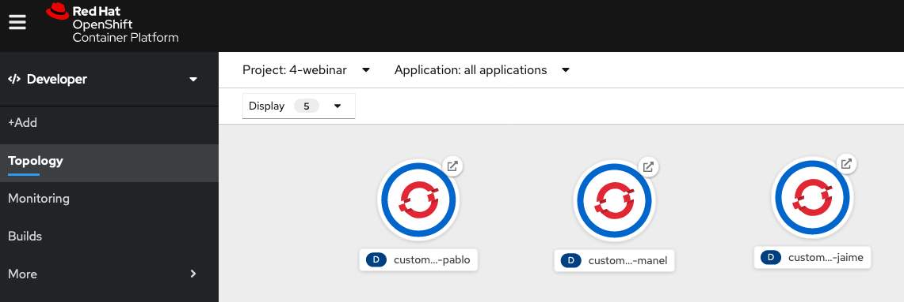
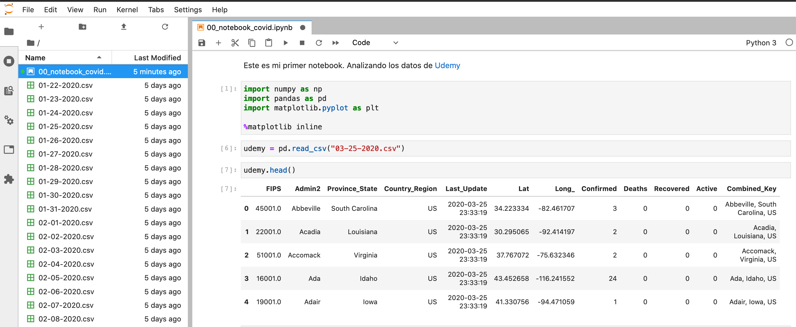

# Webinar Trident
Webinar Trident: El orquestador de almacenamiento para contenedores

## CSI Snapshot

[Web del coronavirus](https://www.arcgis.com/apps/opsdashboard/index.html#/bda7594740fd40299423467b48e9ecf6) y [repositorio de github](https://github.com/CSSEGISandData/COVID-19.git)

```shell
tridentctl import volume BackendForNAS datalake -f 5_CSI_Snapshot/pvc-datalake.yaml -n trident
```

Se muestran el Persistent Volume y Persistent Volume Claim importado.


Se crea el snapshot del PV desde OpenShift.


```shell
apiVersion: snapshot.storage.k8s.io/v1beta1
kind: VolumeSnapshot
metadata:
 name: snap-datalake
 namespace: 4-webinar
spec:
 volumeSnapshotClassName: csi-snapclass
 source:
    persistentVolumeClaimName: datalake
```

Se puede revisar el estado del snapshot con el cliente oc

```shell
oc describe volumesnapshot snap-datalake -n 4-webinar
```

Se verifica que se ha creado el snapshot en el volumen de ONTAP.


Desde la parte de Developer de OpenShift Container Platform, se accede a Topology a se selecciona 'From Catalog'.


Se busca la aplicación



Se instancia la plantilla



Se instancia 3 veces, cambiando los variables, simulando que se crean 3 servicios independientes para 3 Data Sciencies. Tendrán acceso al mismo datalake de forma independiente pero de forma eficiente, sin consumir el triple del espacio.







Esto crea 3 volúmenes clonados de forma eficiente en el sistema ONTAP.


Se pueden ver los tres diferentes servicios.



Accediendo a cada uno de ellos se ve el mismo conjunto de datos.

[http://data-science-jaime-4-webinar.apps.ocp1.demolab.es/](http://data-science-jaime-4-webinar.apps.ocp1.demolab.es/)

[http://data-science-manel-4-webinar.apps.ocp1.demolab.es/](http://data-science-manel-4-webinar.apps.ocp1.demolab.es/)

[http://data-science-pablo-4-webinar.apps.ocp1.demolab.es/](http://data-science-pablo-4-webinar.apps.ocp1.demolab.es/)




A continuación se muestra un ejemplo de la facilidad de mover servicios a una nube pública usando [Kubernetes en Cloud](../6_K8s_on_cloud/k8s_on_cloud.md)