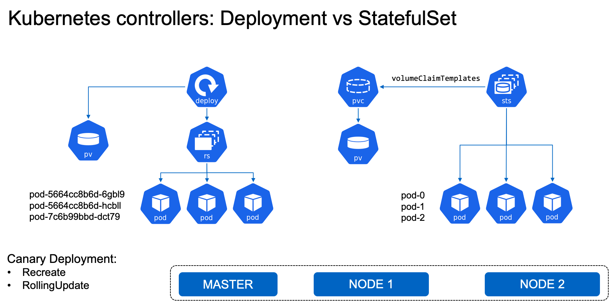
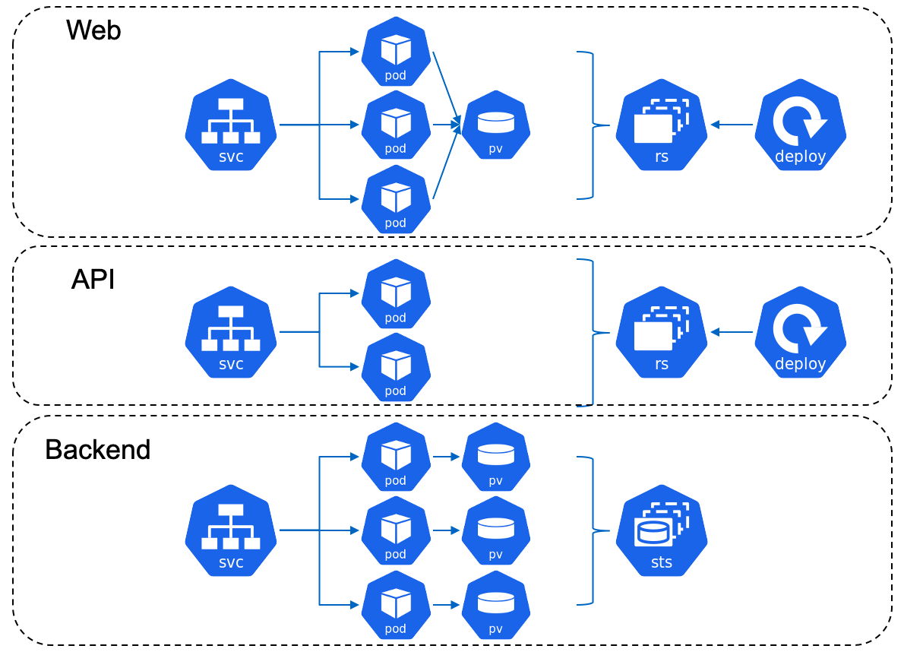

# Webinar Trident
Webinar Trident: El orquestador de almacenamiento para contenedores

## Objetivo
El sistema de almacenamiento de datos es un elemento importante dentro de la arquitectura de contenedores empleada. En esta sesión hemos explicado qué aspectos deberían considerarse a la hora de elegir un sistema de almacenamiento de datos para entornos Docker, Kubernetes upstream o Red Hat OpenShift, y como las soluciones de NetApp cubren estas necesidades. También enseñaremos de forma práctica el funcionamiento de Trident, el orquestador de almacenamiento persistente para contenedores de NetApp.

## Grabación
El enlace a la grabación del webinar será publicado próximamente.

## Demostración
La demostración se ha llevado a cabo utilizando la plataforma OpenShift 4.4 de Red Hat, el sistema de almacenamiento ONTAP de NetApp, y el orquestador Trident de NetApp.

### Instalación de Trident

```shell
wget https://github.com/NetApp/trident/releases/download/v20.04.0/trident-installer-20.04.0.tar.gz

./tridentctl install -n trident
```

### Creación de backends de almacenamiento

backend-san.json
```shell
{
    "version": 1,
    "storageDriverName": "ontap-san",
    "backendName": "BackendForSAN",
    "managementLIF": "10.67.217.5",
    "dataLIF": "10.67.217.7",
    "svm": "SVM_Lab",
    "username": "openshift",
    "password": "Passw0rd",
     "limitVolumeSize": "50Gi",
      "defaults": {
          "spaceReserve": "none",
                   }
 }
```

```shell
tridentctl create backend --filename backend-nas.json -n trident
tridentctl create backend --filename backend-san.json -n trident
```

### Modos de accesos de PVC

| Modo de acceso | Abreviación | Descripción |
| :-------------: |:-----------:| :-----------|
| ReadWriteOnce | RWO | El volumen puede ser montado como lectura-escritura por un solo nodo |
| ReadOnlyMany  | ROW | El volumen puede ser montado como de solo lectura por muchos nodos   |
| ReadWriteMany | RWM | El volumen puede ser montado como lectura-escritura por muchos nodos |

### Controladores de Kubernetes

Existen varios tipos de controladores de Kubernetes:
- ReplicaSet
- Deployment
- StatefulSet
- DaemonSet



### Ejecución de aplicaciones To-Do basada en una arquitectura de 3 capas

En este ejemplo se despliega una sencilla aplicación basada en una arquitectura de 3 capas: frontal web para la capa de presentación, un servicio API para la capa de aplicación y un backend para la capa de datos.



## CSI Snapshot

[Web del coronavirus](https://www.arcgis.com/apps/opsdashboard/index.html#/bda7594740fd40299423467b48e9ecf6) y [repositorio de github](https://github.com/CSSEGISandData/COVID-19.git)


Pueden seguirse todos los pasos realizados en la demostración empezando por la [configuración inicial](1_setup/setup.md) de la integración.